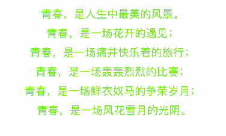

# CAAnimateLabel
A label can animate and quick custom animation 

# Features
* provite some animtion property (duration delay repeatcount etc)
* provite label property like textAliment,lineSpacing,font,color,layouttype
* support NSAttributedString dispaly
* customizable and detect animation by CAAnimateLabelDelegate

# Zoom

# Fall

# Flew

# Alpha

# Spring

# Dash

# Spin

# Reveal

# Throw

# Custom

## Installation

### [CocoaPods](http://cocoapods.org)

1. Install the latest release of CocoaPods: `gem install cocoapods`
2. Add to your Podfile: `pod 'CAAnimateLabel'`
3. Install the pod: `pod install`

# Usage

`See Demo`

