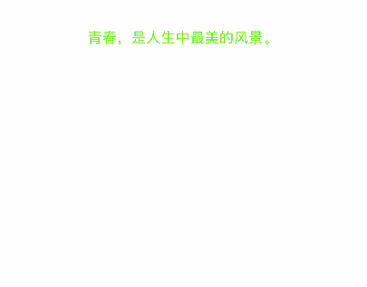

# CAAnimateLabel
A label can animate and quick custom animation 

# Features
* provite some animtion property (duration delay repeatcount etc)
* provite label property like textAliment,lineSpacing,font,color,layouttype
* support NSAttributedString dispaly
* customizable and detect animation by CAAnimateLabelDelegate

# custom animation


## Installation

### [CocoaPods](http://cocoapods.org)

1. Install the latest release of CocoaPods: `gem install cocoapods`
2. Add to your Podfile: `pod 'CAAnimateLabel'`
3. Install the pod: `pod install`


# Demo

```
- (void)initAnimateLabel {
    self.animateLabel.text = @"青春，是人生中最美的风景。\n青春，是一场花开的遇见；\n青春，是一场痛并快乐着的旅行；\n青春，是一场轰轰烈烈的比赛；\n青春，是一场鲜衣奴马的争荣岁月；\n青春，是一场风花雪月的光阴。";
    self.animateLabel.type = self.animateType;
    if (self.animateType == CAAnimateLabelCustomType) {
        self.animateLabel.delayAfterComplete = YES;
    }
    self.animateLabel.layoutType = CATextLayoutSentenceType;
    self.animateLabel.lineSpacing = 10;
    self.animateLabel.textColor = [UIColor greenColor];
    self.animateLabel.textAlignment = CATextAlignmentCenter;
    self.animateLabel.font = [UIFont systemFontOfSize:18.0];
    self.animateLabel.duration = 3.0;
    self.animateLabel.delay = 0.5;
    self.animateLabel.repeatCount = 1;
    self.animateLabel.contentInsets = UIEdgeInsetsMake(100, 10, 10, 10);
    if (self.animateType == CAAnimateLabelCustomType) {
        self.animateLabel.delegate = self;
    }

    /**
     //Set attributedText
     NSMutableParagraphStyle *style = [[NSParagraphStyle defaultParagraphStyle] mutableCopy];
     style.lineSpacing = 20;
     style.alignment = NSTextAlignmentRight;
     
     NSAttributedString *attrStr = [[NSAttributedString alloc] initWithString:self.animateLabel.text attributes:@{NSFontAttributeName : [UIFont systemFontOfSize:20], NSParagraphStyleAttributeName : style, NSForegroundColorAttributeName : [UIColor redColor]}];
     self.animateLabel.attributedText = attrStr;
    */
    
}

```

# CAAnimateLabelDelegate

```
- (void)animationWillStartTextAttribute:(CATextAttribute *)textAttribute forIndex:(NSInteger)index;
- (void)animationDidEndTextAttribute:(CATextAttribute *)textAttribute forIndex:(NSInteger)index;
- (void)animationAtRect:(CGRect)rect textAttribute:(CATextAttribute *)textAttribute forIndex:(NSInteger)index;
```
# Thanks to
ZCAnimatedLabel


