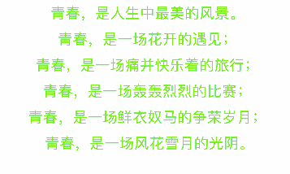

# CAAnimateLabel

[](https://github.com/Carthage/Carthage)
[](https://github.com/ChenAo0727/CAAnimateLabel)
[](https://raw.githubusercontent.com/ChenAo0727/CAAnimateLabel/master/LICENSE)&nbsp;

A label can animate and quick custom animation 

# Features
* provite some animtion property (duration delay repeatcount etc)
* provite label property like textAliment,lineSpacing,font,color,layouttype
* support NSAttributedString dispaly
* customizable and detect animation by CAAnimateLabelDelegate
* customizable animate part of the label


# Zoom


# Fall


# Flew


# Alpha


# Spring


# Dash


# Spin


# Reveal


# Throw


# Custom Draw Animation


# Custom Layer Animation


## Installation

### [CocoaPods](http://cocoapods.org)

1.Install the latest release of CocoaPods or update:

 ```
 gem install cocoapods
 ```
  
2.Add to your Podfile: 

```
pod 'CAAnimateLabel'
```

3.Install the pod or update:

 ```
 pod install
 ```
 
 ```
 pod update
 ```
 
### [Carthage](https://github.com/Carthage/Carthage)

1.Add to your Cartfile:

```
github "ChenAo0727/CAAnimateLabel"
```
2.run `carthage` to build the framework and drag the built `CAAnimatedLabel.framework` into your Xcode project.

```
carthage update --platform ios
```

3.On your application targets’ “Build Phases” settings tab, click the “+” icon and choose “New Run Script Phase”. Create a Run Script in which you specify your shell (ex: /bin/sh), add the following contents to the script area below the shell:

```
/usr/local/bin/carthage copy-frameworks
```

4.add the paths to the frameworks you want to use under “Input Files”, e.g.:

```
$(SRCROOT)/Carthage/Build/iOS/CAAnimatedLabel.framework
```

5.import 

```
#import <CAAnimatedLabel/CAAnimatedLabel.h>
```


# Usage


```
    self.animateLabel = [CAAnimateLabel new];
    self.animateLabel.frame = CGRectMake(0, 0, [UIScreen mainScreen].bounds.size.width, [UIScreen mainScreen].bounds.size.height);
    [self.view insertSubview:self.animateLabel atIndex:0];
    self.animateLabel.type = self.animateType;
    
    self.animateLabel.layoutType = CATextLayoutSentenceType;
    self.animateLabel.lineSpacing = 10;
    self.animateLabel.textColor = [UIColor greenColor];
    self.animateLabel.textAlignment = CATextAlignmentCenter;
    self.animateLabel.font = [UIFont systemFontOfSize:18.0];
    self.animateLabel.duration = 3.0;
    self.animateLabel.delay = 0.5;
    self.animateLabel.repeatCount = 2;
    //animate part of label will be ignore if implement prepareTextAttributes
    self.animateLabel.animateRange = NSMakeRange(10, 10);
    self.animateLabel.text = @"青春，是人生中最美的风景。\n青春，是一场花开的遇见；\n青春，是一场痛并快乐着的旅行；\n青春，是一场轰轰烈烈的比赛；\n青春，是一场鲜衣奴马的争荣岁月；\n青春，是一场风花雪月的光阴。";
    self.animateLabel.contentInsets = UIEdgeInsetsMake(100, 10, 10, 10);
    if (self.animateType == CAAnimateLabelCustomType) {
        self.animateLabel.layerAnimate = YES;
        self.animateLabel.delegate = self;
        self.animateLabel.restore = NO;
    }

```

## Protocol Conformance
Conform to CAAnimateLabelDelegate.

```
@interface ViewController ()<CAAnimateLabelDelegate>
@property (nonatomic, strong) CAAnimateLabel *label;
@end

@implementation ViewController

- (void)viewDidLoad {
    [super viewDidLoad];
    // Do any additional setup after loading the view, typically from a nib.
    self.label.delegate = self;
}

```

## Implementation
```
- (void)prepareTextAttributes:(NSMutableArray<CATextAttribute *> *)textAttrs {
    //custom animate part of label For example
    for (CATextAttribute *attr in textAttrs) {
        if (attr.lineIndex % 2 == 1) {
            attr.animate = NO;
        }
    }
}

- (void)animationWillStartTextAttribute:(CATextAttribute *)textAttribute forIndex:(NSInteger)index {
	//call animation start
}

- (void)animationDidEndTextAttribute:(CATextAttribute *)textAttribute forIndex:(NSInteger)index {
	//call aniamtion end
}

- (void)prepareLayerByTextAttribute:(CATextAttribute *)textAttribute forIndex:(NSInteger)index {
  //call when layerAnimate is YES prepare layer animation
}

- (CGRect)animationDrawRectForTextAttribute:(CATextAttribute *)textAttribute forIndex:(NSInteger)index {
    // Reture draw animation rect
    return textAttribute.rect;
}

- (void)animationAtRect:(CGRect)rect ForTextAttribute:(CATextAttribute *)textAttribute forIndex:(NSInteger)index {
   //custom layer or draw aniamtion 
    
}
```

## License
MIT License

Copyright (c) 2017 ChenAo

Permission is hereby granted, free of charge, to any person obtaining a copy
of this software and associated documentation files (the "Software"), to deal
in the Software without restriction, including without limitation the rights
to use, copy, modify, merge, publish, distribute, sublicense, and/or sell
copies of the Software, and to permit persons to whom the Software is
furnished to do so, subject to the following conditions:

The above copyright notice and this permission notice shall be included in all
copies or substantial portions of the Software.

THE SOFTWARE IS PROVIDED "AS IS", WITHOUT WARRANTY OF ANY KIND, EXPRESS OR
IMPLIED, INCLUDING BUT NOT LIMITED TO THE WARRANTIES OF MERCHANTABILITY,
FITNESS FOR A PARTICULAR PURPOSE AND NONINFRINGEMENT. IN NO EVENT SHALL THE
AUTHORS OR COPYRIGHT HOLDERS BE LIABLE FOR ANY CLAIM, DAMAGES OR OTHER
LIABILITY, WHETHER IN AN ACTION OF CONTRACT, TORT OR OTHERWISE, ARISING FROM,
OUT OF OR IN CONNECTION WITH THE SOFTWARE OR THE USE OR OTHER DEALINGS IN THE
SOFTWARE.


